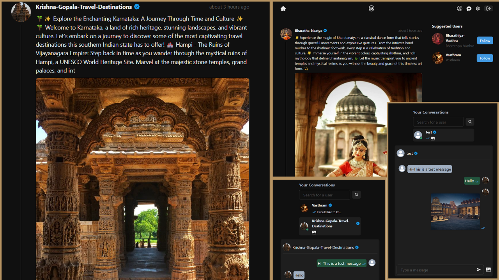

# Threads App Clone

Crafted and deployed a Threads app clone, featuring real-time chat functionality, utilizing the MERN stack along with Socket.io and Chakra UI. Key features include authentication and authorization using JWT, post creation and deletion, post liking/unliking, commenting on posts, user following/unfollowing, account freezing capability, and support for both dark and light modes. The application is fully responsive and includes a chat feature with image support, as well as seen/unseen status indicators for messages and notification sounds for enhanced user experience.

## Technologies Utilized

- **MongoDB**
- **ReactJS**
- **Socket.io**
- **Chakra UI**
- **Express**
- **Node.js**

## Deployment 

This web app is deployed on Render. 
